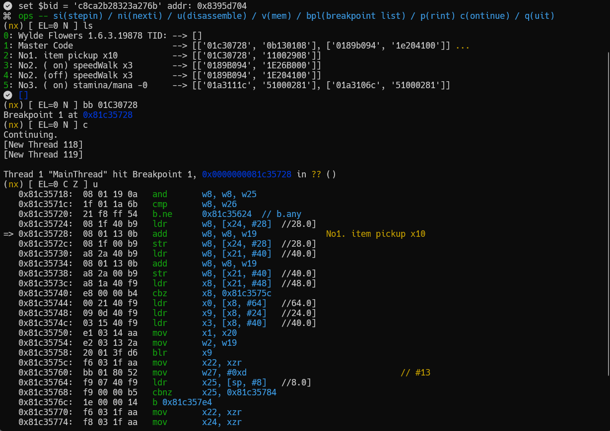
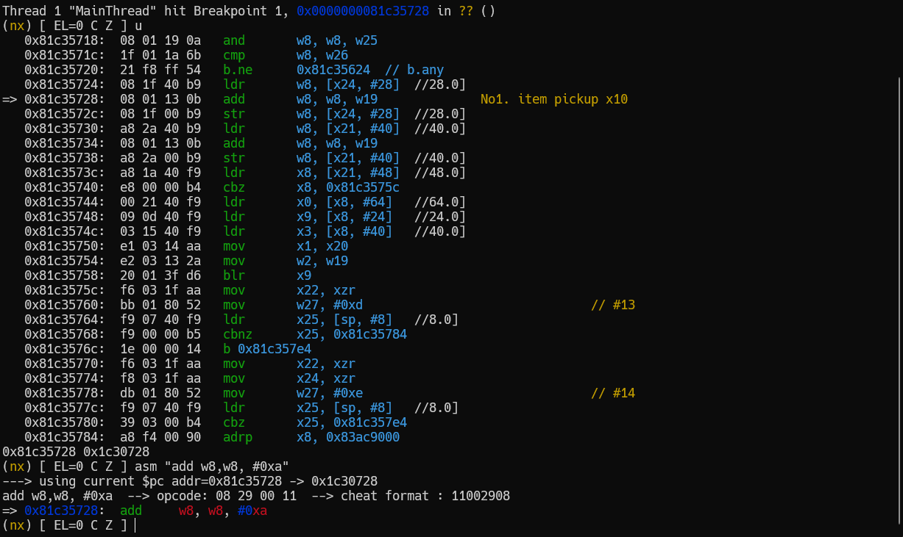

gdb tips for nx via yuzu GDBstub 
```
0.   ln -s .gdbinit_arm64 ~/.gdbinit
1.   for yuzu enable for debug first 
2.   gdb-multiarch 
3.   (gdb) yuzu     (remote target 192.168.1.188:6543)
4.   (gdb) c        (continue)
4.1  CTRL-C 
5.   (gdb) kk       (monitor get info for nro main address)
7.   (gdb) u        (dissassemble info with $pc) 
```     
         
         
      
 
 
[gdbida credit to Comsecuris](https://github.com/Comsecuris/gdbida)

[more information for switch modding cheatsheet](https://gist.github.com/jam1garner/c9ba6c0cff150f1a2480d0c18ff05e33)
