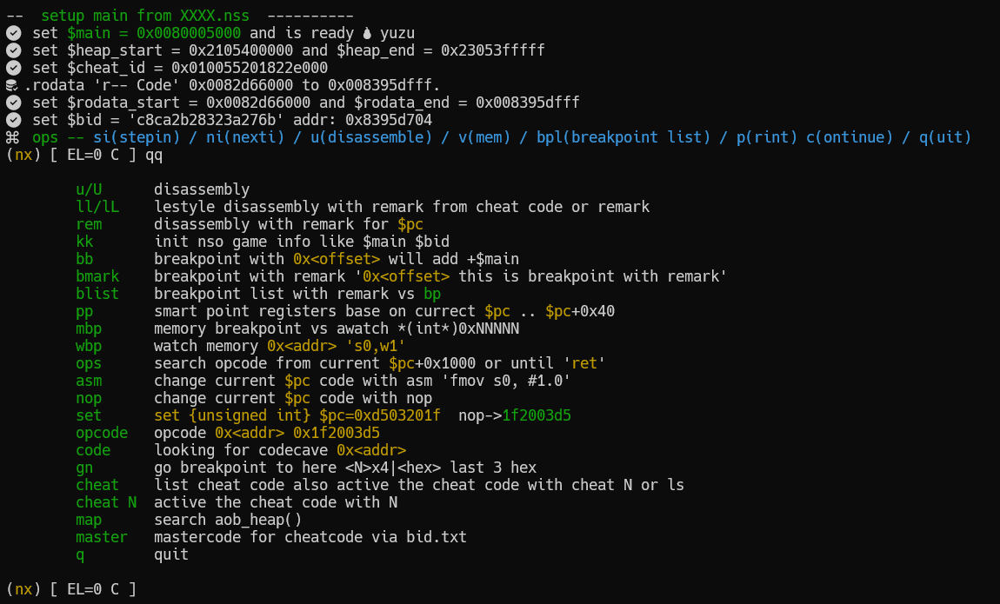

0.   ln -s .gdbinit_arm64 ~/.gdbinit

1.   for yuzu enable for debug first 
2.   gdb-multiarch 
3.   (gdb) yuzu     (remote target 192.168.1.188:6543)
4.   (gdb) c        (continue)
4.1  CTRL-C 
5.   (gdb) kk       (monitor get info for nro main address)
7.   (gdb) u        (dissassemble info with $pc) 
     
         
     
